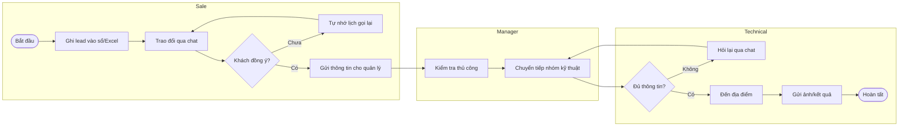
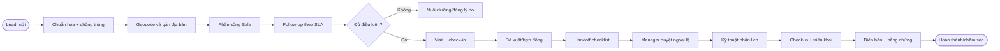

# 02. Khảo sát hiện trạng

## 2.1 Phương pháp khảo sát đề xuất

| Hoạt động | Mẫu tối thiểu | Đầu ra |
|---|---:|---|
| Phỏng vấn Sale | 12 người/3 chi nhánh | Journey, pain point |
| Shadowing hiện trường | 6 ca làm | Thời gian thao tác, lỗi GPS |
| Phỏng vấn Kỹ thuật | 8 người | Handoff checklist |
| Workshop quản lý | 2 phiên | KPI, scope dữ liệu |
| Data profiling | 3 tháng dữ liệu | Trùng, thiếu, sai định dạng |
| Security/privacy workshop | 1 phiên | Consent, retention, incident |
| Usability test prototype | 8 người | Task success, SUS |

Các con số trong chương này là baseline thiết kế cần được xác nhận trong pilot discovery, không phải kết quả khảo sát đã thực hiện.

## 2.2 Persona và công việc cần hoàn thành

| Persona | Bối cảnh | Job to be done | Tiêu chí thành công |
|---|---|---|---|
| Sale hiện trường | Di chuyển liên tục, mạng không ổn định | Ghi lead và follow-up nhanh | Tạo lead < 60 giây |
| Kỹ thuật viên | Nhận nhiều lịch triển khai | Đủ thông tin và đến đúng nơi | Handoff không thiếu trường bắt buộc |
| Sales Manager | Quản lý 10-30 nhân viên | Biết pipeline và ngoại lệ | Dashboard cập nhật < 5 phút |
| Branch Manager | Chịu KPI chi nhánh | So sánh vùng/đội | Số liệu truy vết được |
| Admin | Quản trị tenant nội bộ | Cấu hình an toàn | Không cấp quyền vượt scope |

## 2.3 Pain point chi tiết

| ID | Tình huống | Root cause | Severity | Giải pháp |
|---|---|---|---:|---|
| PP-01 | Hai Sale cùng chăm một số điện thoại | Không có unique normalized key | Critical | Duplicate detection + merge |
| PP-02 | Địa chỉ “hẻm 12” không tìm được | Thiếu pin/ghi chú đường vào | High | Pin map + landmark |
| PP-03 | Quên gọi lại sau 3 ngày | Không SLA/reminder | High | Rule-based reminder |
| PP-04 | Check-in từ xa | Không geofence/device signal | Critical | Distance, accuracy, mock flag |
| PP-05 | GPS làm hao pin | Tần suất cố định quá cao | High | Adaptive sampling |
| PP-06 | Manager xem dữ liệu ngoài chi nhánh | Scope không chặt | Critical | Row-level authorization |
| PP-07 | Kỹ thuật thiếu loại hạ tầng | Handoff tự do qua chat | High | Structured checklist |
| PP-08 | Báo cáo Excel khác số | Công thức và cutoff khác nhau | High | Semantic definitions |
| PP-09 | Nhập lại khi mất mạng | Không local queue | High | Offline outbox |
| PP-10 | Audit không đủ ai/ở đâu | Log ứng dụng rời rạc | High | Structured audit context |

## 2.4 BPMN quy trình As-Is

## 2.5 BPMN quy trình To-Be

## 2.6 SWOT

| | Tích cực | Tiêu cực |
|---|---|---|
| Nội bộ | **Strengths:** thương hiệu, lực lượng hiện trường, dữ liệu khách hàng, mạng lưới chi nhánh | **Weaknesses:** dữ liệu phân mảnh, kỹ năng số không đồng đều, quy trình địa phương khác nhau |
| Bên ngoài | **Opportunities:** smartphone phổ biến, bản đồ/AI trưởng thành, tự động hóa vận hành | **Threats:** quy định dữ liệu cá nhân, GPS spoofing, chi phí Maps, tấn công tài khoản |

## 2.7 Gap analysis

| Capability | As-Is | To-Be | Priority |
|---|---|---|---|
| Customer 360 | Phân tán | Một hồ sơ và timeline | Must |
| Territory | Thủ công | Polygon + rule | Should |
| Tracking | Không chuẩn | Consent session + quality | Must |
| Reminder | Cá nhân | SLA + escalation | Must |
| Analytics | Excel trễ | Dashboard có semantic metric | Must |
| AI | Không có | Summary/suggest có phê duyệt | Could |

## 2.8 Tiêu chí pilot

- 2 chi nhánh, 50 Sale, 20 Kỹ thuật, 6 quản lý trong 8 tuần.
- Ít nhất 2.000 lead được import với tỷ lệ lỗi dưới 2%.
- 90% người dùng hoàn thành 5 task cốt lõi không cần hỗ trợ.
- Tỷ lệ crash-free session >= 99.5%.
- Không có sự cố rò rỉ dữ liệu hoặc cấp quyền sai.
- Quyết định rollout dựa trên KPI, usability và privacy review.

