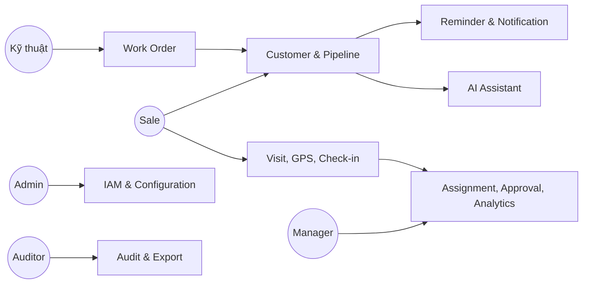

# 04. Use Case

## 4.1 Sơ đồ tổng quát

## 4.2 Quy ước

- Preconditions chung: tenant hoạt động, người dùng đã xác thực, account không khóa.
- Exception chung: `401` khi token không hợp lệ, `403` khi thiếu permission/scope, `409` khi version conflict, `503` khi dependency tạm lỗi.
- Acceptance Criteria dùng Given/When/Then; mọi thao tác ghi phải idempotent khi có `Idempotency-Key`.

## 4.3 Catalog 54 Use Case

### UC-001 - Đăng nhập

| Thuộc tính | Nội dung |
|---|---|
| Actor | Sale, Kỹ thuật, Manager, Admin |
| Description | Xác thực bằng email/mã nhân viên và mật khẩu, trả access/refresh token. |
| Preconditions | Account active; tenant active. |
| Main Flow | 1. Nhập credential. 2. Server kiểm tra rate limit và password. 3. Nếu role yêu cầu MFA, chuyển bước OTP. 4. Tạo session, token family và audit. |
| Alternative Flow | SSO/OIDC trả authorization code; hệ thống ánh xạ external identity. |
| Exception | Sai credential trả thông báo chung; account khóa; tenant disabled; OTP hết hạn. |
| Post Condition | Session active, `lastLoginAt` cập nhật, không log credential. |
| Acceptance Criteria | Given account hợp lệ, when xác thực đúng, then access token sống 10 phút và refresh token được rotation; 5 lần sai kích hoạt delay/lock theo policy. |

### UC-002 - Làm mới token

| Thuộc tính | Nội dung |
|---|---|
| Actor | Authenticated client |
| Description | Đổi refresh token hợp lệ lấy token pair mới. |
| Preconditions | Refresh token chưa hết hạn/revoke. |
| Main Flow | Hash token, khóa bản ghi, xác minh family, revoke token cũ, phát token mới. |
| Alternative Flow | Token sắp hết absolute lifetime chỉ phát access token và yêu cầu đăng nhập lại. |
| Exception | Reuse token cũ làm revoke toàn family và tạo security event. |
| Post Condition | Chỉ token mới nhất của chain dùng được. |
| Acceptance Criteria | Hai request đồng thời chỉ một request thành công; token bản rõ không lưu DB/log. |

### UC-003 - Đăng xuất và thu hồi phiên

| Thuộc tính | Nội dung |
|---|---|
| Actor | User, Admin |
| Description | User logout phiên hiện tại hoặc Admin revoke phiên người dùng. |
| Preconditions | Có session hoặc permission `sessions.revoke`. |
| Main Flow | Chọn phiên, revoke refresh family, đóng SignalR connection, audit. |
| Alternative Flow | User chọn “đăng xuất mọi thiết bị”. |
| Exception | Session đã revoke trả thành công idempotent. |
| Post Condition | Refresh không dùng lại; access token hết hạn tự nhiên hoặc blacklist khi khẩn cấp. |
| Acceptance Criteria | Phiên bị revoke không refresh được trong <= 5 giây. |

### UC-004 - Quản lý MFA

| Thuộc tính | Nội dung |
|---|---|
| Actor | User, Admin |
| Description | Enroll TOTP, xác nhận, tạo recovery code, disable có xác minh. |
| Preconditions | Password/reauth hợp lệ. |
| Main Flow | Sinh secret, hiển thị QR một lần, xác nhận OTP, mã hóa secret, phát recovery codes hash. |
| Alternative Flow | Admin reset MFA sau quy trình xác minh danh tính. |
| Exception | OTP lệch ngoài window; recovery code đã dùng. |
| Post Condition | MFA state và audit cập nhật. |
| Acceptance Criteria | Secret không xuất hiện lại; mỗi recovery code dùng một lần. |

### UC-005 - Quản lý người dùng

| Thuộc tính | Nội dung |
|---|---|
| Actor | Admin |
| Description | Tạo, cập nhật, khóa, mở khóa và gán đơn vị cho user. |
| Preconditions | `users.manage` trong scope. |
| Main Flow | Nhập mã nhân viên/email/department, validate unique, tạo user, gửi activation. |
| Alternative Flow | Import CSV chạy background và trả file lỗi từng dòng. |
| Exception | Trùng employee code; department ngoài scope; tự hạ quyền admin cuối cùng. |
| Post Condition | User và audit tồn tại; cache permission invalidated. |
| Acceptance Criteria | Admin chi nhánh không tạo user ở chi nhánh khác; khóa user revoke session. |

### UC-006 - Quản lý role và permission

| Thuộc tính | Nội dung |
|---|---|
| Actor | Admin |
| Description | Tạo role tùy biến và gán permission. |
| Preconditions | `roles.manage`; không sửa system role bị khóa. |
| Main Flow | Tạo role, chọn permission, xem diff, xác nhận, version role. |
| Alternative Flow | Clone role rồi chỉnh. |
| Exception | Permission vượt scope của admin; role đang là role cuối giữ quyền critical. |
| Post Condition | Policy cache invalidated; thay đổi được audit. |
| Acceptance Criteria | Quyền mới có hiệu lực <= 60 giây; mọi thay đổi hiển thị before/after. |

### UC-007 - Quản lý phòng ban và địa bàn

| Thuộc tính | Nội dung |
|---|---|
| Actor | Admin, Manager |
| Description | Cấu hình cây tổ chức và polygon địa bàn. |
| Preconditions | Có quyền quản lý organization/territory. |
| Main Flow | Tạo node, chọn parent, vẽ polygon, kiểm tra giao nhau, publish. |
| Alternative Flow | Import GeoJSON có preview. |
| Exception | Tạo vòng lặp cây; polygon invalid; overlap không được phê duyệt. |
| Post Condition | Version địa bàn mới active; lead tương lai dùng version mới. |
| Acceptance Criteria | Không mất lịch sử địa bàn cũ; polygon phải đóng và hợp lệ. |

### UC-008 - Tạo lead

| Thuộc tính | Nội dung |
|---|---|
| Actor | Sale, Manager |
| Description | Tạo lead từ thông tin liên hệ, nguồn và nhu cầu. |
| Preconditions | `customers.create`. |
| Main Flow | Nhập phone/name/address/source, normalize, dò trùng, geocode, lưu, tạo timeline. |
| Alternative Flow | Đặt pin thủ công; lưu draft offline; tiếp tục sau cảnh báo fuzzy duplicate. |
| Exception | Exact duplicate bị chặn; phone sai; source bắt buộc thiếu. |
| Post Condition | Lead `New`, owner theo rule hoặc `Unassigned`, reminder SLA được tạo. |
| Acceptance Criteria | Online P95 < 2 giây không tính geocode; offline sync không tạo bản trùng. |

### UC-009 - Import lead

| Thuộc tính | Nội dung |
|---|---|
| Actor | Manager, Admin |
| Description | Import CSV/XLSX theo template. |
| Preconditions | File <= 20 MB; `customers.import`. |
| Main Flow | Upload, virus scan, map cột, dry-run, hiển thị lỗi/trùng, confirm, background import. |
| Alternative Flow | Chỉ update bản ghi match bằng external key. |
| Exception | Encoding sai, vượt scope, lỗi > 20% thì không commit. |
| Post Condition | Batch report gồm created/updated/skipped/errors. |
| Acceptance Criteria | Import atomic theo chunk 500; mỗi dòng lỗi có code và cột. |

### UC-010 - Xem danh sách lead

| Thuộc tính | Nội dung |
|---|---|
| Actor | Sale, Manager, Admin |
| Description | Tìm, lọc, sắp xếp và phân trang lead theo scope. |
| Preconditions | `customers.read`. |
| Main Flow | Chọn filter status/owner/territory/date, server seek pagination, trả summary. |
| Alternative Flow | Lưu filter thành saved view. |
| Exception | Filter invalid; sort field không allowlist. |
| Post Condition | Không thay đổi dữ liệu. |
| Acceptance Criteria | Không lộ lead ngoài scope; page 100 dòng P95 < 500 ms. |

### UC-011 - Xem Customer 360

| Thuộc tính | Nội dung |
|---|---|
| Actor | Sale, Kỹ thuật, Manager |
| Description | Xem hồ sơ, timeline, visits, reminders, contract và work order. |
| Preconditions | Có resource scope. |
| Main Flow | Load summary trước, lazy-load tab, mask field theo permission. |
| Alternative Flow | Deep link tới timeline event. |
| Exception | Customer soft-deleted chỉ role phù hợp thấy tombstone. |
| Post Condition | Ghi access audit nếu xem GPS/PII restricted. |
| Acceptance Criteria | Kỹ thuật chỉ thấy dữ liệu cần triển khai; phone masked nếu thiếu permission. |

### UC-012 - Cập nhật lead

| Thuộc tính | Nội dung |
|---|---|
| Actor | Owner, Manager |
| Description | Sửa thuộc tính lead với optimistic concurrency. |
| Preconditions | `customers.update`; có ETag/version. |
| Main Flow | Sửa field, validate, compare version, lưu history và audit. |
| Alternative Flow | Client merge khi conflict trên note không trùng field. |
| Exception | Version cũ; field restricted; status transition sai. |
| Post Condition | Version tăng, timeline event được tạo. |
| Acceptance Criteria | Không silent overwrite; before/after của PII được bảo vệ trong audit. |

### UC-013 - Phát hiện và merge trùng

| Thuộc tính | Nội dung |
|---|---|
| Actor | Manager, Data Steward |
| Description | So sánh hai hồ sơ và hợp nhất có kiểm soát. |
| Preconditions | `customers.merge`; hai record cùng tenant. |
| Main Flow | Hiển thị diff, chọn survivor và giá trị từng field, chuyển child records, mark duplicate. |
| Alternative Flow | Đánh dấu “không trùng” để giảm cảnh báo tương lai. |
| Exception | Hai customer đã có contract xung đột; concurrent update. |
| Post Condition | Một survivor, redirect mapping và audit đầy đủ. |
| Acceptance Criteria | Không mất note/file/visit; thao tác chạy transaction và idempotent. |

### UC-014 - Chuyển trạng thái pipeline

| Thuộc tính | Nội dung |
|---|---|
| Actor | Sale, Manager |
| Description | Chuyển trạng thái theo state machine. |
| Preconditions | Owner hoặc manager scope. |
| Main Flow | Chọn trạng thái, nhập field bắt buộc, validate rule, lưu history, chạy automation. |
| Alternative Flow | Manager override transition với reason. |
| Exception | Thiếu loss reason/handoff data; transition không hợp lệ. |
| Post Condition | Status mới, reminder/notification tương ứng. |
| Acceptance Criteria | Mỗi transition có actor/time/from/to/reason; automation không chạy trùng. |

### UC-015 - Phân công lead

| Thuộc tính | Nội dung |
|---|---|
| Actor | Manager, Assignment Engine |
| Description | Gán/chuyển owner thủ công hoặc theo rule. |
| Preconditions | Owner đích active và thuộc scope. |
| Main Flow | Chọn lead, xem workload, chọn owner/reason, confirm, notify hai bên. |
| Alternative Flow | Bulk assign tối đa 1.000 lead bằng job. |
| Exception | Owner nghỉ/khóa; lead locked; cross-branch cần approval. |
| Post Condition | Assignment history mới; SLA có thể reset theo policy. |
| Acceptance Criteria | Không có hai owner active; notification không gửi trùng. |

### UC-016 - Ghi interaction/note

| Thuộc tính | Nội dung |
|---|---|
| Actor | Sale, Kỹ thuật |
| Description | Ghi cuộc gọi, tin nhắn, gặp mặt và note. |
| Preconditions | Có quyền trên customer. |
| Main Flow | Chọn type/outcome, nhập nội dung, thời gian, attachment, next action. |
| Alternative Flow | Voice-to-text tạo draft, user phải duyệt. |
| Exception | Nội dung vượt 10.000 ký tự; attachment unsafe. |
| Post Condition | Timeline event và reminder nếu có next action. |
| Acceptance Criteria | Offline replay giữ original occurredAt và không duplicate. |

### UC-017 - Lập lịch visit

| Thuộc tính | Nội dung |
|---|---|
| Actor | Sale, Kỹ thuật, Manager |
| Description | Tạo lịch gặp/khảo sát với địa điểm và người phụ trách. |
| Preconditions | Customer có address hoặc pin. |
| Main Flow | Chọn thời gian, assignee, purpose, geofence, reminder; kiểm tra xung đột. |
| Alternative Flow | Tạo recurring visit; manager vẫn cho phép overlap có reason. |
| Exception | Thời gian quá khứ; assignee unavailable. |
| Post Condition | Visit `Scheduled`, calendar/reminder/notification tạo. |
| Acceptance Criteria | Hiển thị timezone đúng; thay đổi lịch thông báo người liên quan. |

### UC-018 - Bắt đầu ca và tracking

| Thuộc tính | Nội dung |
|---|---|
| Actor | Sale, Kỹ thuật |
| Description | Bắt đầu ca và route session sau consent. |
| Preconditions | GPS permission; không có session active. |
| Main Flow | Hiển thị purpose/retention, user consent, kiểm tra device, tạo shift/session. |
| Alternative Flow | Bắt đầu ca không tracking nếu policy cho phép và ghi reason. |
| Exception | GPS disabled; consent declined; session khác active. |
| Post Condition | Tracking indicator hiển thị; session active. |
| Acceptance Criteria | Không thu điểm trước consent; user dừng được bất kỳ lúc nào. |

### UC-019 - Gửi batch GPS

| Thuộc tính | Nội dung |
|---|---|
| Actor | Client application |
| Description | Đồng bộ các route point có quality metadata. |
| Preconditions | Session active; batch <= 100 điểm. |
| Main Flow | Gửi idempotency key, validate bounds/order, enqueue, acknowledge sequence. |
| Alternative Flow | Late points sau stop được nhận trong grace period 15 phút. |
| Exception | Sai session owner; impossible speed; payload quá lớn. |
| Post Condition | Raw points lưu với quality flag; aggregate cập nhật async. |
| Acceptance Criteria | Retry cùng key không tăng số điểm; ingest 10 triệu điểm/ngày. |

### UC-020 - Dừng ca/tracking

| Thuộc tính | Nội dung |
|---|---|
| Actor | Sale, Kỹ thuật, System |
| Description | Dừng session thủ công hoặc auto theo policy. |
| Preconditions | Session active. |
| Main Flow | Flush local buffer, gửi stop, server đóng session, tính distance/duration. |
| Alternative Flow | System auto-stop sau inactivity/end-of-day và báo user. |
| Exception | Offline: lưu stop command và không thu điểm mới. |
| Post Condition | Session stopped; route summary sẵn sàng eventual. |
| Acceptance Criteria | Stop local có hiệu lực ngay; server không nhận điểm ngoài grace period. |

### UC-021 - Xem tuyến đường

| Thuộc tính | Nội dung |
|---|---|
| Actor | Employee, Manager |
| Description | Xem polyline, điểm dừng và visit theo ngày. |
| Preconditions | `tracking.read.self/team`; ngày trong retention. |
| Main Flow | Chọn user/date, load simplified polyline, quality legend, stops. |
| Alternative Flow | So sánh planned và actual route. |
| Exception | Điểm đã anonymize; thiếu permission restricted GPS. |
| Post Condition | GPS access audit. |
| Acceptance Criteria | Manager chỉ xem team; polyline không nối qua GPS gap như đường thật. |

### UC-022 - Check-in visit

| Thuộc tính | Nội dung |
|---|---|
| Actor | Sale, Kỹ thuật |
| Description | Xác nhận có mặt tại visit/customer. |
| Preconditions | Visit scheduled/allowed; GPS permission. |
| Main Flow | Thu location/accuracy/device time, tính distance, chụp ảnh nếu cần, tạo result. |
| Alternative Flow | Offline pending; ngoài geofence gửi request review với reason. |
| Exception | Mock location detected; accuracy > 200 m; visit canceled. |
| Post Condition | Check-in Valid/Review/Rejected; timeline và audit. |
| Acceptance Criteria | Khoảng cách tính server-side; không cho client tự khai distance. |

### UC-023 - Check-out và kết quả visit

| Thuộc tính | Nội dung |
|---|---|
| Actor | Sale, Kỹ thuật |
| Description | Kết thúc visit, ghi outcome và next action. |
| Preconditions | Có check-in hoặc override. |
| Main Flow | Thu vị trí, duration, outcome, note, attachment; cập nhật visit. |
| Alternative Flow | Check-out không GPS có reason khi permission/device lỗi. |
| Exception | Checkout trước checkin; required checklist thiếu. |
| Post Condition | Visit Completed/Exception; automation chạy. |
| Acceptance Criteria | Outcome Qualified tạo bước pipeline phù hợp nhưng yêu cầu user confirm. |

### UC-024 - Duyệt check-in ngoại lệ

| Thuộc tính | Nội dung |
|---|---|
| Actor | Manager |
| Description | Duyệt/từ chối check-in ngoài geofence hoặc chất lượng thấp. |
| Preconditions | `checkins.review`; không tự duyệt check-in của chính mình. |
| Main Flow | Xem map, accuracy, route context, evidence, reason; quyết định. |
| Alternative Flow | Yêu cầu bổ sung thông tin. |
| Exception | Evidence hết hạn; reviewer conflict of interest. |
| Post Condition | Final decision, audit, employee notified. |
| Acceptance Criteria | Không sửa raw coordinates; decision reason tối thiểu 10 ký tự. |

### UC-025 - Tìm khách hàng gần đây

| Thuộc tính | Nội dung |
|---|---|
| Actor | Sale, Manager |
| Description | Tìm customer trong bán kính từ vị trí/map center. |
| Preconditions | `customers.read`; radius 0.1-20 km. |
| Main Flow | Gửi center/radius/filter, spatial query, trả distance và cluster. |
| Alternative Flow | Dùng current GPS hoặc pin chọn trên map. |
| Exception | Coordinate invalid; quá nhiều kết quả yêu cầu thu hẹp. |
| Post Condition | Không đổi dữ liệu. |
| Acceptance Criteria | Kết quả sort theo distance chính xác; scope được áp trước query. |

### UC-026 - Điều hướng Google Maps

| Thuộc tính | Nội dung |
|---|---|
| Actor | Sale, Kỹ thuật |
| Description | Mở route tới customer/visit. |
| Preconditions | Destination có coordinate/address. |
| Main Flow | Chọn mode, tạo Google Maps URL/deep link, ghi navigation event không chứa lịch sử ngoài cần thiết. |
| Alternative Flow | Web route preview nếu app Maps không có. |
| Exception | Maps unavailable; destination invalid. |
| Post Condition | Không thay đổi customer. |
| Acceptance Criteria | Destination ưu tiên coordinate đã xác minh, URL encode an toàn. |

### UC-027 - Tạo reminder

| Thuộc tính | Nội dung |
|---|---|
| Actor | User, System |
| Description | Tạo nhắc việc một lần/định kỳ liên kết customer/visit. |
| Preconditions | Due time hợp lệ. |
| Main Flow | Nhập title, due, priority, recurrence, assignee; validate; schedule. |
| Alternative Flow | Automation tạo từ outcome/SLA. |
| Exception | Recurrence vô hạn không policy; assignee inactive. |
| Post Condition | Reminder Scheduled và job đăng ký. |
| Acceptance Criteria | Lưu UTC, hiển thị local; automation dùng deterministic key chống trùng. |

### UC-028 - Hoàn thành/hoãn reminder

| Thuộc tính | Nội dung |
|---|---|
| Actor | Assignee |
| Description | Complete, snooze, reschedule hoặc cancel reminder. |
| Preconditions | Reminder active và user có quyền. |
| Main Flow | Chọn action, nhập outcome/reason, update state, tạo occurrence tiếp theo. |
| Alternative Flow | Bulk complete reminder hệ thống sau interaction. |
| Exception | Reminder đã completed; version conflict. |
| Post Condition | History và escalation state cập nhật. |
| Acceptance Criteria | Recurring rule tạo đúng một occurrence kế; snooze không đổi original due. |

### UC-029 - Nhận notification

| Thuộc tính | Nội dung |
|---|---|
| Actor | User |
| Description | Nhận, đọc, đánh dấu và mở deep link notification. |
| Preconditions | Notification thuộc user. |
| Main Flow | SignalR/push báo, inbox load, user open, mark read. |
| Alternative Flow | Email digest theo preference. |
| Exception | Deep link resource đã xóa/ngoài scope. |
| Post Condition | `readAt` cập nhật; delivery receipt lưu. |
| Acceptance Criteria | Cùng event/channel không gửi trùng; unread count eventual <= 5 giây. |

### UC-030 - Cấu hình notification

| Thuộc tính | Nội dung |
|---|---|
| Actor | User, Admin |
| Description | Chọn kênh, quiet hours, digest; Admin đặt mandatory event. |
| Preconditions | Channel provider enabled. |
| Main Flow | Load matrix event/channel, cập nhật, validate mandatory, save. |
| Alternative Flow | Reset default. |
| Exception | Tắt security notification bắt buộc. |
| Post Condition | Preference version mới. |
| Acceptance Criteria | Quiet hours dùng timezone user; critical event bỏ qua quiet hours có nhãn rõ. |

### UC-031 - Tạo contract metadata

| Thuộc tính | Nội dung |
|---|---|
| Actor | Sale |
| Description | Ghi tham chiếu hợp đồng, gói dịch vụ và trạng thái ký. |
| Preconditions | Customer Qualified/Proposal; `contracts.create`. |
| Main Flow | Nhập package/value/reference/sign date, upload document, validate uniqueness. |
| Alternative Flow | Liên kết contract từ hệ thống ngoài. |
| Exception | Reference trùng; file chưa scan; value invalid. |
| Post Condition | Contract Draft/Signed; timeline tạo. |
| Acceptance Criteria | Không lưu dữ liệu thẻ/thanh toán; signed transition cần document/reference. |

### UC-032 - Tạo handoff kỹ thuật

| Thuộc tính | Nội dung |
|---|---|
| Actor | Sale, Manager |
| Description | Chuyển customer đã ký sang kỹ thuật bằng checklist. |
| Preconditions | Contract Signed; required data đủ. |
| Main Flow | Review checklist, chọn window, submit; rule quyết định auto/approval; tạo work order. |
| Alternative Flow | Save draft; expedited handoff cần manager approval. |
| Exception | Thiếu pin/contact/infrastructure; duplicate active work order. |
| Post Condition | Handoff Submitted/Approved và work order Open. |
| Acceptance Criteria | Submit atomic; kỹ thuật thấy đúng snapshot dữ liệu đã bàn giao. |

### UC-033 - Duyệt handoff

| Thuộc tính | Nội dung |
|---|---|
| Actor | Manager |
| Description | Duyệt/reject handoff có ngoại lệ. |
| Preconditions | PendingApproval trong scope. |
| Main Flow | Xem checklist/diff/risk, approve hoặc reject có reason. |
| Alternative Flow | Return for correction không đóng request. |
| Exception | Contract đã hủy; handoff version thay đổi. |
| Post Condition | Approved tạo work order; rejected notify Sale. |
| Acceptance Criteria | Reviewer không phải submitter khi policy four-eyes bật. |

### UC-034 - Phân công work order

| Thuộc tính | Nội dung |
|---|---|
| Actor | Technical Manager |
| Description | Gán kỹ thuật viên theo vùng, kỹ năng và tải. |
| Preconditions | Work order Open; assignee active. |
| Main Flow | Xem recommendation, availability, chọn assignee/time, notify. |
| Alternative Flow | Auto-assign theo rule; bulk schedule. |
| Exception | Skill mismatch; overlap; ngoài branch. |
| Post Condition | Work order Assigned, SLA bắt đầu. |
| Acceptance Criteria | Assignment history đầy đủ; override recommendation có reason. |

### UC-035 - Thực hiện work order

| Thuộc tính | Nội dung |
|---|---|
| Actor | Kỹ thuật |
| Description | Accept, travel, check-in, triển khai và cập nhật tiến độ. |
| Preconditions | Assigned cho actor. |
| Main Flow | Accept, navigate, check-in, start, checklist, attachments, result. |
| Alternative Flow | Pause do khách/hạ tầng; request support. |
| Exception | Customer absent; unsafe location; equipment issue. |
| Post Condition | Completed/Failed/RevisitRequired và notification. |
| Acceptance Criteria | Completed bắt buộc checklist, checkout và biên bản; raw evidence bất biến. |

### UC-036 - Lập lịch tái triển khai

| Thuộc tính | Nội dung |
|---|---|
| Actor | Kỹ thuật, Technical Manager |
| Description | Tạo revisit từ failed work order. |
| Preconditions | Failure reason cho phép retry. |
| Main Flow | Chọn reason/action/date/assignee, tạo child work order liên kết parent. |
| Alternative Flow | Escalate survey team. |
| Exception | Contract canceled; vượt max attempts cần manager approve. |
| Post Condition | Parent giữ failure; child scheduled. |
| Acceptance Criteria | Không ghi đè lịch sử attempt; customer được thông báo theo consent. |

### UC-037 - Dashboard cá nhân

| Thuộc tính | Nội dung |
|---|---|
| Actor | Sale, Kỹ thuật |
| Description | Xem task hôm nay, overdue, pipeline, visits và KPI cá nhân. |
| Preconditions | Authenticated. |
| Main Flow | Load widgets song song, filter date, drill-down tới danh sách. |
| Alternative Flow | Offline hiển thị cache có timestamp. |
| Exception | Widget dependency lỗi hiển thị partial state. |
| Post Condition | Không đổi dữ liệu. |
| Acceptance Criteria | First meaningful content < 2 giây trên 4G; metric định nghĩa có tooltip. |

### UC-038 - Dashboard quản lý

| Thuộc tính | Nội dung |
|---|---|
| Actor | Manager |
| Description | Xem funnel, SLA, map activity, workload và exceptions. |
| Preconditions | `analytics.read.team`. |
| Main Flow | Chọn period/team, load aggregate, compare previous, drill-down scoped. |
| Alternative Flow | Saved dashboard/filter. |
| Exception | Khoảng ngày > 24 tháng yêu cầu export. |
| Post Condition | Query metric được telemetry. |
| Acceptance Criteria | Tổng drill-down bằng widget trong cùng cutoff; dữ liệu trễ có nhãn. |

### UC-039 - Export báo cáo

| Thuộc tính | Nội dung |
|---|---|
| Actor | Manager, Auditor |
| Description | Xuất CSV/XLSX theo filter và field permission. |
| Preconditions | `exports.create`; reauth với export restricted. |
| Main Flow | Chọn template/filter, estimate rows, confirm purpose, job tạo file mã hóa/signed URL. |
| Alternative Flow | <= 5.000 dòng stream đồng bộ. |
| Exception | Vượt giới hạn; field restricted; job timeout. |
| Post Condition | Export record/audit, file hết hạn 24 giờ. |
| Acceptance Criteria | File watermark user/time; không chứa field bị mask; download được audit. |

### UC-040 - Xem audit log

| Thuộc tính | Nội dung |
|---|---|
| Actor | Admin, Auditor |
| Description | Tìm audit theo actor/action/resource/time/correlation. |
| Preconditions | `audit.read`; restricted scope. |
| Main Flow | Filter, seek page, xem before/after redacted, correlation chain. |
| Alternative Flow | Export audit cần elevated approval. |
| Exception | Query quá rộng; field secret luôn redacted. |
| Post Condition | Việc xem audit cũng được audit. |
| Acceptance Criteria | UI/API không có update/delete audit; hash chain verify được. |

### UC-041 - Quản lý file

| Thuộc tính | Nội dung |
|---|---|
| Actor | User |
| Description | Upload, preview, download và archive attachment. |
| Preconditions | Quyền resource; file allowlist/size. |
| Main Flow | Request upload, upload storage, scan, finalize attachment, signed download. |
| Alternative Flow | Multipart/resumable upload. |
| Exception | Malware, MIME mismatch, expired upload. |
| Post Condition | File Available/Quarantined; metadata và audit. |
| Acceptance Criteria | Storage key ngẫu nhiên; signed URL <= 5 phút; quarantined không tải được. |

### UC-042 - Cấu hình hệ thống

| Thuộc tính | Nội dung |
|---|---|
| Actor | Admin |
| Description | Quản lý typed settings, SLA, geofence, retention và feature flags. |
| Preconditions | Permission theo setting namespace. |
| Main Flow | Chọn setting, xem schema/current/default, edit, validate, preview impact, publish. |
| Alternative Flow | Schedule activation; rollback version. |
| Exception | Value ngoài range; retention dưới legal minimum. |
| Post Condition | Version mới, cache invalidated, audit. |
| Acceptance Criteria | Không sửa secret qua generic UI; critical setting cần four-eyes. |

### UC-043 - Quản lý thiết bị và phiên

| Thuộc tính | Nội dung |
|---|---|
| Actor | User, Admin |
| Description | Xem device/session, đổi tên, revoke, đánh dấu mất. |
| Preconditions | Owner hoặc `devices.manage`. |
| Main Flow | Liệt kê last active/IP masked/user-agent, chọn revoke/block. |
| Alternative Flow | Trust device trong thời hạn policy. |
| Exception | Không revoke được phiên hiện tại cuối cùng nếu chưa reauth. |
| Post Condition | Session revoke; device risk state cập nhật. |
| Acceptance Criteria | IP hiển thị masked; lost device revoke mọi session liên quan. |

### UC-044 - AI tóm tắt khách hàng

| Thuộc tính | Nội dung |
|---|---|
| Actor | Sale, Manager |
| Description | Tạo summary có citation từ timeline được phép. |
| Preconditions | `ai.summary`; AI enabled; customer scope. |
| Main Flow | Server chọn dữ liệu, redact, prompt model, validate output, trả citations/confidence. |
| Alternative Flow | Dùng cached summary nếu dữ liệu không đổi. |
| Exception | Provider timeout; unsafe output; context vượt budget. |
| Post Condition | AI run metadata lưu, không tự ghi vào hồ sơ chính. |
| Acceptance Criteria | Mỗi fact quan trọng có source event; user thấy disclaimer và có feedback. |

### UC-045 - AI đề xuất next best action

| Thuộc tính | Nội dung |
|---|---|
| Actor | Sale |
| Description | Đề xuất hành động tiếp theo dựa trên trạng thái/SLA/lịch sử. |
| Preconditions | Dữ liệu tối thiểu đủ; AI/rule engine enabled. |
| Main Flow | Tính rule features, gọi model nếu cần, trả 1-3 action với rationale. |
| Alternative Flow | Rule-only khi AI unavailable. |
| Exception | Suggestion xung đột policy bị filter. |
| Post Condition | Chỉ khi user accept mới tạo reminder/draft. |
| Acceptance Criteria | Không tự gửi khách; acceptance/rejection được ghi để đánh giá. |

### UC-046 - AI customer score

| Thuộc tính | Nội dung |
|---|---|
| Actor | Sale, Manager |
| Description | Hiển thị propensity score và yếu tố giải thích. |
| Preconditions | Model version active; consent/purpose hợp lệ. |
| Main Flow | Load score, band, top factors, calculatedAt/modelVersion. |
| Alternative Flow | “Insufficient data” thay vì điểm giả. |
| Exception | Drift/quality threshold fail làm disable model. |
| Post Condition | Không tự đổi priority nếu chưa có rule được duyệt. |
| Acceptance Criteria | Không dùng protected attribute; có monitoring bias/drift. |

### UC-047 - AI gợi ý tuyến

| Thuộc tính | Nội dung |
|---|---|
| Actor | Sale, Manager |
| Description | Sắp xếp visits theo cửa sổ thời gian, ưu tiên và khoảng cách. |
| Preconditions | 2-20 visits có coordinate. |
| Main Flow | Chọn visits/start/end, optimizer tạo route, hiển thị ETA/constraint, user accept. |
| Alternative Flow | Heuristic nearest-neighbor khi Maps route API lỗi. |
| Exception | Không có route; time window bất khả thi. |
| Post Condition | Accepted plan versioned; không thay actual tracking. |
| Acceptance Criteria | Hiển thị constraint bị vi phạm; user kéo sắp xếp và tính lại được. |

### UC-048 - Đồng bộ offline

| Thuộc tính | Nội dung |
|---|---|
| Actor | Client application |
| Description | Replay outbox notes/check-ins/GPS khi mạng trở lại. |
| Preconditions | Local encrypted store; authenticated session hoặc refresh được. |
| Main Flow | Sort dependency, refresh token, gửi idempotent commands, nhận mapping local-server ID. |
| Alternative Flow | Partial success giữ item lỗi và tiếp tục item độc lập. |
| Exception | Auth revoked; schema version unsupported; conflict. |
| Post Condition | Item Acked/NeedsReview/Failed; UI cập nhật. |
| Acceptance Criteria | Không mất dữ liệu khi app restart; retry exponential; user thấy trạng thái. |

### UC-049 - Xử lý yêu cầu dữ liệu cá nhân

| Thuộc tính | Nội dung |
|---|---|
| Actor | Privacy Admin, Auditor |
| Description | Search, export, correct, anonymize theo yêu cầu hợp lệ. |
| Preconditions | Request đã xác minh danh tính và legal basis. |
| Main Flow | Tạo case, discover records, legal hold check, approve, execute, evidence report. |
| Alternative Flow | Reject/limit request với legal reason. |
| Exception | Legal hold; record shared bắt buộc giữ; identity chưa đủ. |
| Post Condition | Case closed, actions audit, downstream notified. |
| Acceptance Criteria | Dual approval cho anonymize; backup xử lý theo retention documented. |

### UC-050 - Health, incident và vận hành

| Thuộc tính | Nội dung |
|---|---|
| Actor | SRE, System |
| Description | Quan sát health, alert, maintenance mode và incident trail. |
| Preconditions | Ops authentication; endpoint health không lộ secret. |
| Main Flow | Probe liveness/readiness, collect metrics, alert, create incident, execute runbook. |
| Alternative Flow | Degraded mode tắt AI/Maps feature flag. |
| Exception | Monitoring outage dùng external synthetic probe. |
| Post Condition | Incident timeline, resolution và postmortem action. |
| Acceptance Criteria | Readiness fail loại instance khỏi LB; liveness không phụ thuộc provider ngoài. |

### UC-051 - Bulk update bản ghi

| Thuộc tính | Nội dung |
|---|---|
| Actor | Manager, Admin |
| Description | Cập nhật hàng loạt status/owner/tag trên tập bản ghi đã lọc. |
| Preconditions | Có permission tương ứng; tập kết quả đã được filter và đếm. |
| Main Flow | Chọn filter/bản ghi, chọn field thay đổi, preview tác động, xác nhận, job chạy nền theo lô. |
| Alternative Flow | Chọn thủ công một phần thay vì toàn bộ kết quả filter. |
| Exception | Bản ghi vượt scope/vi phạm rule bị bỏ qua; vượt giới hạn 500 yêu cầu chia nhỏ. |
| Post Condition | Mỗi dòng thay đổi có audit; báo cáo success/skipped/failed. |
| Acceptance Criteria | Idempotent theo job key; partial failure không rollback dòng đã thành công; tôn trọng ETag/RowVersion. |

### UC-052 - Restore bản ghi đã xóa mềm

| Thuộc tính | Nội dung |
|---|---|
| Actor | Manager, Admin |
| Description | Khôi phục customer/visit/work order đã soft-delete trong restore window. |
| Preconditions | Bản ghi `IsDeleted=1`; còn trong window 30 ngày; có permission `*.restore`. |
| Main Flow | Xem danh sách đã xóa, chọn bản ghi, kiểm tra xung đột unique, xác nhận, khôi phục quan hệ. |
| Alternative Flow | Restore kèm reassign owner nếu owner cũ đã vô hiệu. |
| Exception | Hết window; định danh duy nhất bị chiếm; legal hold/anonymized không cho restore. |
| Post Condition | Bản ghi active trở lại; audit before/after; thông báo owner. |
| Acceptance Criteria | Không tạo trùng; quan hệ phụ thuộc nhất quán; ghi rõ lý do restore. |

### UC-053 - Quản lý thiết bị cá nhân

| Thuộc tính | Nội dung |
|---|---|
| Actor | All authenticated user |
| Description | Xem, đặt tên, thu hồi thiết bị và đăng xuất từ xa. |
| Preconditions | Đăng nhập; danh sách thiết bị từ `iam.Devices`. |
| Main Flow | Liệt kê thiết bị + lần dùng cuối, đổi tên, revoke thiết bị; revoke-all cần reauth. |
| Alternative Flow | Admin thu hồi thiết bị của user trong scope khi nghi ngờ lộ. |
| Exception | Thiết bị `RiskStatus` cao buộc reauth/MFA trước thao tác nhạy cảm. |
| Post Condition | Session-family và push token của thiết bị revoke; audit ghi nhận. |
| Acceptance Criteria | Revoke có hiệu lực <= 5 giây; không revoke nhầm thiết bị ngoài scope. |

### UC-054 - Xem lịch sử phiên bản và diff

| Thuộc tính | Nội dung |
|---|---|
| Actor | Scoped users, Auditor |
| Description | Xem các phiên bản thay đổi của customer/contract/work order và diff giữa hai phiên bản. |
| Preconditions | Có quyền đọc bản ghi; audit/history có dữ liệu. |
| Main Flow | Mở tab History, chọn hai phiên bản, hệ thống dựng diff field-level từ audit before/after. |
| Alternative Flow | Khôi phục giá trị một field về phiên bản cũ (cần permission, tạo phiên bản mới). |
| Exception | Field nhạy cảm hiển thị masked; phiên bản ngoài retention chỉ còn metadata. |
| Post Condition | Không thay đổi dữ liệu khi chỉ xem; restore field sinh audit mới. |
| Acceptance Criteria | Diff đúng thứ tự thời gian; không lộ PII vượt quyền; nguồn dữ liệu là audit bất biến. |

## 4.4 Ma trận actor-use case

| Nhóm | Sale | Kỹ thuật | Manager | Admin | System |
|---|---:|---:|---:|---:|---:|
| UC-001..007 IAM | C | C | C | R | C |
| UC-008..017 CRM | R | C | A | C | C |
| UC-018..026 Field | R | R | A | I | C |
| UC-027..030 Reminder | R | R | A | C | C |
| UC-031..036 Contract/Tech | R | R | A | C | C |
| UC-037..043 Analytics/Admin | C | C | R | R | C |
| UC-044..050 AI/Ops | R | C | A | R | R |
| UC-051..054 Data governance | C | I | R | A | C |

