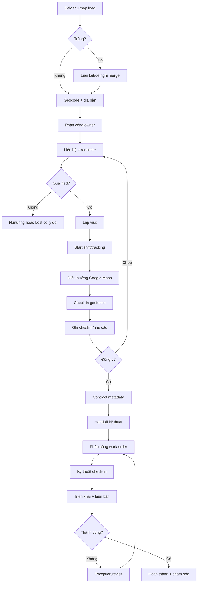
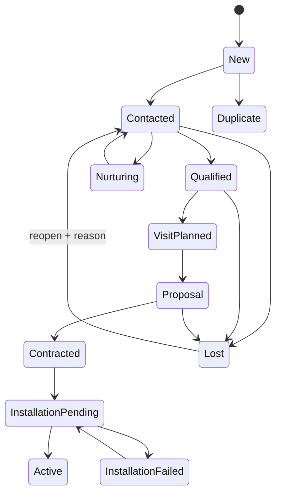
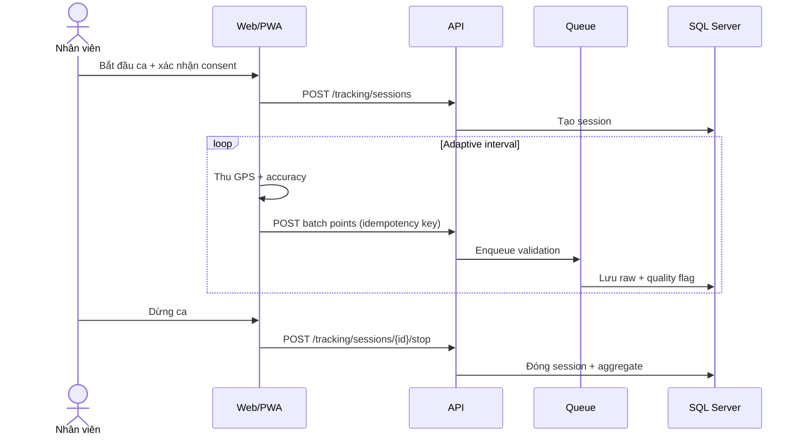
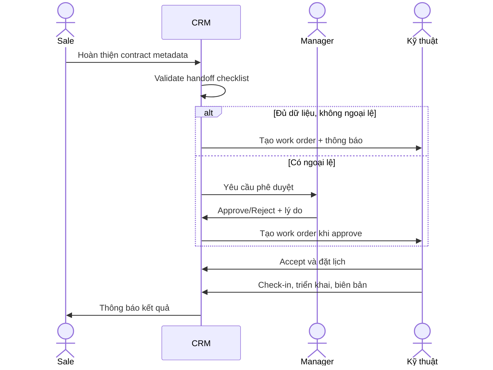
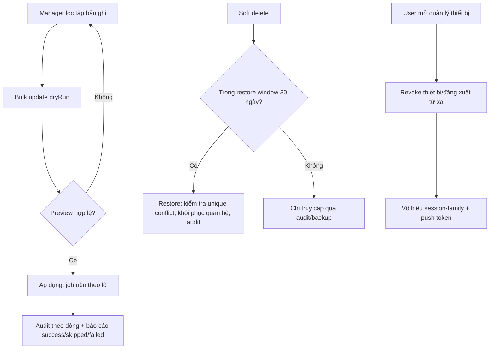

# 05. Business Flow

## 5.1 End-to-end flow

## 5.2 State machine khách hàng

## 5.3 Quy trình thu thập và phân công lead

| Step | Owner | Input | Xử lý | Output | SLA |
|---|---|---|---|---|---|
| 1 | Sale/System | Phone, name, address | Normalize, validate consent/source | Draft lead | 30 giây |
| 2 | System | Draft | Exact/fuzzy duplicate check | Match candidates | 2 giây |
| 3 | Sale | Candidate list | Link, request merge hoặc continue | Unique lead | 60 giây |
| 4 | System | Address/pin | Geocode, territory resolve | Coordinates/territory | 3 giây |
| 5 | Manager/rule | Lead | Assign owner by workload/area | Assignment | 15 phút |
| 6 | System | Assignment | Notify, create first-contact SLA | Task/reminder | Tức thời |

**Ngoại lệ:** địa chỉ không geocode được cho phép đặt pin thủ công; lead ngoài địa bàn vào queue `Unassigned`; lead VIP không auto-assign.

## 5.4 Follow-up và reminder

1. Sale ghi kết quả mỗi tương tác bằng outcome chuẩn.
2. Outcome `CallBack` bắt buộc thời gian tiếp theo; hệ thống tạo reminder.
3. Reminder gửi in-app trước 15 phút, push theo preference.
4. Quá hạn hiển thị đỏ; sau 24 giờ tạo escalation cho manager.
5. Hoàn thành reminder phải liên kết interaction hoặc reason `NoActionRequired`.
6. Reschedule quá ba lần trong 14 ngày được gắn cờ coaching.

## 5.5 GPS route tracking

**Sampling:** 15-30 giây khi di chuyển, 60-180 giây khi đứng yên, ngừng khi hết ca. Client buffer tối đa 2.000 điểm; gửi batch khi có mạng. Server không tin timestamp/accuracy client tuyệt đối.

## 5.6 Check-in

| Kiểm tra | Pass | Review | Reject |
|---|---|---|---|
| Distance | <= radius | radius đến 2x radius | > 2x radius |
| Accuracy | <= 100 m | 101-200 m | > 200 m |
| Time skew | <= 5 phút | 5-15 phút | > 15 phút |
| Mock signal | Không | Không xác định | Có |
| Attachment required | Đủ | Upload pending offline | Thiếu sau sync |

Check-in `Review` không bị mất; tạo exception cho manager. Manual override bắt buộc reason, người duyệt và audit.

## 5.7 Hợp đồng và bàn giao kỹ thuật

Checklist: contact, service address + pin, product/package, bandwidth, installation window, infrastructure note, customer consent, contract reference và attachment bắt buộc.

## 5.8 Quy trình ngoại lệ

| Event | Owner đầu tiên | Escalation | Resolution |
|---|---|---|---|
| Duplicate disputed | Data steward | Branch Admin | Merge/keep separate |
| Invalid check-in | Manager | Security khi lặp lại | Accept/reject |
| GPS gap > 15 phút | Employee | Manager | Reason + evidence |
| Handoff rejected | Sale | Sales Manager | Bổ sung/resubmit |
| Installation failed | Technician | Technical Manager | Reason + revisit |
| Notification dead-letter | System | SRE | Retry/provider switch |
| AI unsafe output | User | AI Owner/Security | Flag, quarantine, evaluate |

## 5.9 RACI

| Hoạt động | Sale | Kỹ thuật | Manager | Admin | System |
|---|---|---|---|---|---|
| Tạo lead | R | I | A | I | C |
| Merge lead | C | I | A | R | C |
| Follow-up | R/A | I | C | I | C |
| Check-in | R | R | A | I | C |
| Handoff | R | C | A | I | C |
| Work order | I | R | A | C | C |
| Permission | I | I | C | R/A | C |
| Retention | I | I | C | R | A |

## 5.10 Business continuity

- Maps lỗi: cho nhập địa chỉ/pin gần nhất và mở ứng dụng bản đồ ngoài bằng deep link khi khả dụng.
- AI lỗi: ẩn suggestion, không chặn CRM.
- Notification lỗi: in-app inbox vẫn là nguồn chính; retry exponential.
- Mất mạng: thao tác ghi vào local encrypted outbox; UI hiển thị `Pending sync`.
- Conflict: server dùng version; client cho người dùng chọn giữ server, giữ bản local hoặc merge trường cho notes.

## 5.11 Data governance: bulk, restore, device, version

- Bulk update: luôn có preview (dryRun), giới hạn 500 dòng, chạy nền với job key idempotent, tôn trọng scope/RowVersion từng bản ghi (BR-016).
- Restore: chỉ trong restore window, cần permission `*.restore`, chặn khi định danh duy nhất đã bị chiếm (BR-017).
- Device: thu hồi thiết bị vô hiệu hóa toàn bộ session và push của thiết bị đó tức thì; tối đa 10 thiết bị/người (BR-018).
- Version history: diff dựng từ audit bất biến; khôi phục field tạo phiên bản mới, không ghi đè lịch sử.

