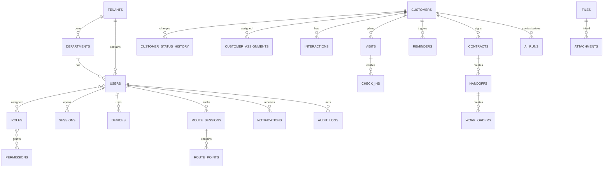

# 06. Database Design

## 6.1 Nguyên tắc

- SQL Server, schema theo bounded context: `iam`, `crm`, `field`, `ops`, `notify`, `audit`, `ai`.
- PK nội bộ `bigint IDENTITY`; public ID `uniqueidentifier` default `NEWSEQUENTIALID()`.
- Mọi aggregate có `RowVersion rowversion`, `CreatedAtUtc datetime2(3)`, `CreatedBy`, `UpdatedAtUtc`, `UpdatedBy`, `IsDeleted bit DF 0`, `DeletedAtUtc datetime2(3) NULL`, `DeletedBy bigint NULL` và `DeleteReason nvarchar(400) NULL`. Bộ cột này cho phép soft delete có thể truy vết, restore trong cửa sổ cho phép và áp dụng retention/anonymize theo `DeletedAtUtc`.
- Toàn bộ truy vấn nghiệp vụ áp global query filter `IsDeleted = 0`; chỉ endpoint khôi phục có permission `*.restore` mới `IgnoreQueryFilters` để đọc bản ghi đã xóa mềm.
- Optimistic concurrency dùng `RowVersion` cho mọi update, bulk update và restore; xung đột trả `409`/`412` với current representation.
- FK mặc định `NO ACTION`; chỉ cascade cho bảng nối/chi tiết không có ý nghĩa độc lập.
- String dùng `nvarchar`; enum lưu `varchar(32)` với check constraint hoặc lookup table khi cần quản trị.
- Tọa độ có cột `geography` và lat/lng để debug; spatial index trên geography.
- PII tìm kiếm dùng normalized/hash columns; giá trị nhạy cảm mã hóa.

## 6.2 ERD

## 6.3 Data dictionary - IAM và tổ chức

Mỗi dòng dưới đây là một bảng. `IX` là index; `UQ` unique; `DF` default; `CK` check.

| ID/Bảng | Cột chính: DataType, PK/FK, Default/Constraint | Index | Mô tả |
|---|---|---|---|
| DB-01 `iam.Tenants` | `Id bigint PK`; `PublicId uniqueidentifier DF NEWSEQUENTIALID`; `Code varchar(32) UQ`; `Name nvarchar(200)`; `Status varchar(20) CK`; audit columns | `UQ(Code)`, `IX(Status)` | Tenant logic; V1 có thể chỉ một tenant nhưng không hard-code |
| DB-02 `iam.Departments` | `Id PK`; `TenantId FK Tenants`; `ParentId FK self NULL`; `Code varchar(32)`; `Name nvarchar(200)`; `Path hierarchyid`; `Status` | `UQ(TenantId,Code)`, `IX(Path)`, `IX(ParentId)` | Cây chi nhánh/phòng/đội; không cho vòng lặp |
| DB-03 `iam.Users` | `Id PK`; `TenantId FK`; `DepartmentId FK`; `EmployeeCode varchar(32)`; `EmailNormalized varchar(256)`; `PhoneEncrypted varbinary`; `PasswordHash nvarchar(500) NULL`; `Status`; `LastLoginAtUtc NULL` | `UQ(TenantId,EmployeeCode)`, `UQ(TenantId,EmailNormalized)`, `IX(DepartmentId,Status)` | Danh tính người dùng |
| DB-04 `iam.Roles` | `Id PK`; `TenantId FK NULL` cho system role; `Code`; `Name`; `IsSystem bit DF 0`; `Version int DF 1` | `UQ(TenantId,Code)` | Nhóm permission versioned |
| DB-05 `iam.Permissions` | `Id PK`; `Code varchar(100) UQ`; `Resource`; `Action`; `Description` | `UQ(Code)`, `IX(Resource,Action)` | Catalog quyền atomic |
| DB-06 `iam.UserRoles` | `UserId FK`; `RoleId FK`; `ScopeType varchar(20)`; `ScopeId bigint NULL`; `ValidFromUtc`; `ValidToUtc NULL`; composite PK | `PK(UserId,RoleId,ScopeType,ScopeId)`, `IX(RoleId)` | Gán role theo scope và thời hạn |
| DB-07 `iam.RolePermissions` | `RoleId FK`; `PermissionId FK`; composite PK | `PK(RoleId,PermissionId)`, `IX(PermissionId)` | Bảng nối role-permission |
| DB-08 `iam.Sessions` | `Id PK`; `UserId FK`; `TokenFamilyId uniqueidentifier`; `RefreshTokenHash binary(32)`; `ExpiresAtUtc`; `RevokedAtUtc NULL`; `ReplacedById FK self NULL`; `IpHash`; `UserAgentHash` | `UQ(RefreshTokenHash)`, `IX(UserId,RevokedAtUtc)`, `IX(TokenFamilyId)` | Refresh rotation và reuse detection |
| DB-09 `iam.Devices` | `Id PK`; `UserId FK`; `DeviceKeyHash binary(32)`; `Name`; `Platform`; `PushTokenEncrypted`; `RiskStatus`; `LastSeenAtUtc` | `UQ(UserId,DeviceKeyHash)`, `IX(UserId,LastSeenAtUtc)` | Thiết bị và push registration |
| DB-10 `iam.MfaMethods` | `Id PK`; `UserId FK`; `Type`; `SecretEncrypted varbinary`; `IsVerified bit`; `RecoveryCodeHash NULL`; `UsedAtUtc NULL` | `IX(UserId,Type,IsVerified)` | TOTP/recovery; không lưu code bản rõ |

## 6.4 Data dictionary - CRM

| ID/Bảng | Cột chính: DataType, PK/FK, Default/Constraint | Index | Mô tả |
|---|---|---|---|
| DB-11 `crm.Customers` | `Id PK`; `PublicId`; `TenantId FK`; `OwnerUserId FK NULL`; `TerritoryId FK NULL`; `Type varchar(20)`; `FullName`; `PhoneEncrypted`; `PhoneHash binary(32)`; `EmailEncrypted`; `StatusCode`; `SourceCode`; `Address`; `Latitude decimal(9,6)`; `Longitude`; `Geo geography`; `Score decimal(5,2) NULL`; audit/rowversion | `UQ(TenantId,PhoneHash) WHERE IsDeleted=0`; `IX(OwnerUserId,StatusCode)`; spatial `SIX(Geo)` | Lead/customer aggregate |
| DB-12 `crm.CustomerStatusHistory` | `Id PK`; `CustomerId FK`; `FromStatus`; `ToStatus`; `ReasonCode NULL`; `ReasonText NULL`; `ChangedBy FK Users`; `ChangedAtUtc` | `IX(CustomerId,ChangedAtUtc DESC)` | Lịch sử pipeline bất biến |
| DB-13 `crm.CustomerAssignments` | `Id PK`; `CustomerId FK`; `UserId FK`; `AssignedBy FK`; `Reason`; `StartedAtUtc`; `EndedAtUtc NULL`; `IsPrimary bit` | filtered `UQ(CustomerId) WHERE IsPrimary=1 AND EndedAtUtc IS NULL`; `IX(UserId,EndedAtUtc)` | Ownership history |
| DB-14 `crm.CustomerMergeMap` | `DuplicateCustomerId PK/FK`; `SurvivorCustomerId FK`; `MergedBy`; `MergedAtUtc`; `DecisionJson nvarchar(max) CK ISJSON` | `IX(SurvivorCustomerId)` | Redirect/audit merge |
| DB-15 `crm.Interactions` | `Id PK`; `CustomerId FK`; `ActorUserId FK`; `Type`; `Outcome`; `OccurredAtUtc`; `ContentEncrypted`; `NextActionAtUtc NULL`; `Source`; `ClientCommandId uniqueidentifier` | `UQ(ClientCommandId)`; `IX(CustomerId,OccurredAtUtc DESC)` | Call/message/meeting/note |
| DB-16 `crm.Territories` | `Id PK`; `TenantId FK`; `DepartmentId FK`; `Code`; `Name`; `Boundary geography`; `Version`; `EffectiveFromUtc`; `EffectiveToUtc NULL` | `UQ(TenantId,Code,Version)`; spatial `SIX(Boundary)` | Polygon địa bàn versioned |
| DB-17 `crm.Contracts` | `Id PK`; `CustomerId FK`; `ExternalReference`; `PackageCode`; `Value decimal(19,4) DF 0 CK >=0`; `Status`; `SignedAtUtc NULL`; `Version` | `UQ(CustomerId,ExternalReference)`; `IX(Status,SignedAtUtc)` | Metadata hợp đồng, không phải billing |

## 6.5 Data dictionary - Field operations

| ID/Bảng | Cột chính: DataType, PK/FK, Default/Constraint | Index | Mô tả |
|---|---|---|---|
| DB-18 `field.Visits` | `Id PK`; `CustomerId FK`; `AssigneeUserId FK`; `Purpose`; `ScheduledStartUtc`; `ScheduledEndUtc CK end>start`; `GeofenceRadiusM int DF 100 CK 20..1000`; `Status`; `Outcome NULL`; `Version` | `IX(AssigneeUserId,ScheduledStartUtc)`; `IX(CustomerId,Status)` | Lịch gặp/khảo sát |
| DB-19 `field.VisitNotes` | `Id PK`; `VisitId FK`; `AuthorUserId FK`; `ContentEncrypted`; `OccurredAtUtc`; `ClientCommandId` | `UQ(ClientCommandId)`; `IX(VisitId,OccurredAtUtc)` | Note riêng của visit |
| DB-20 `field.CheckIns` | `Id PK`; `VisitId FK`; `UserId FK`; `Type CK IN/OUT`; `ClientOccurredAtUtc`; `ServerReceivedAtUtc`; `Latitude`; `Longitude`; `Geo geography`; `AccuracyM decimal(8,2)`; `DistanceM`; `MockFlag`; `Status`; `ReviewReason NULL`; `ClientCommandId` | `UQ(ClientCommandId)`; `IX(VisitId,Type)`; `IX(UserId,ServerReceivedAtUtc)` | Bằng chứng check-in/out |
| DB-21 `field.RouteSessions` | `Id PK`; `UserId FK`; `DeviceId FK`; `ShiftStartUtc`; `ShiftEndUtc NULL`; `ConsentVersion`; `Status`; `DistanceM decimal(12,2) DF 0`; `PointCount int DF 0` | filtered `UQ(UserId) WHERE Status='Active'`; `IX(UserId,ShiftStartUtc DESC)` | Phiên tracking theo ca |
| DB-22 `field.RoutePoints` | `Id bigint`; `SessionId FK`; `SequenceNo int`; `OccurredAtUtc`; `ReceivedAtUtc`; `Latitude`; `Longitude`; `Geo`; `AccuracyM`; `SpeedMps NULL`; `Heading NULL`; `QualityCode`; `Source`; partition key `OccurredDate date` | clustered `PK(OccurredDate,Id)`; `UQ(SessionId,SequenceNo,OccurredDate)`; spatial index tùy partition | GPS raw volume lớn |
| DB-23 `field.RouteSummaries` | `SessionId PK/FK`; `PolylineEncoded nvarchar(max)`; `DistanceM`; `MovingSeconds`; `StoppedSeconds`; `GapCount`; `CalculatedAtUtc`; `AlgorithmVersion` | `IX(CalculatedAtUtc)` | Read model tuyến đã simplify |
| DB-24 `ops.Handoffs` | `Id PK`; `ContractId FK`; `SubmittedBy FK`; `Status`; `ChecklistJson CK ISJSON`; `SnapshotJson CK ISJSON`; `RequestedWindowStartUtc`; `RequestedWindowEndUtc`; `ReviewedBy NULL`; `ReviewReason NULL` | `IX(Status,RequestedWindowStartUtc)`; `UQ(ContractId) WHERE active` | Bàn giao có snapshot |
| DB-25 `ops.WorkOrders` | `Id PK`; `HandoffId FK`; `ParentWorkOrderId FK NULL`; `AssigneeUserId FK NULL`; `Status`; `Priority`; `ScheduledStartUtc`; `SlaDueAtUtc`; `FailureReasonCode NULL`; `CompletedAtUtc NULL`; `Version` | `IX(AssigneeUserId,Status,ScheduledStartUtc)`; `IX(SlaDueAtUtc,Status)` | Công việc kỹ thuật/revisit |

## 6.6 Data dictionary - Notification, files, audit, AI

| ID/Bảng | Cột chính: DataType, PK/FK, Default/Constraint | Index | Mô tả |
|---|---|---|---|
| DB-26 `notify.Reminders` | `Id PK`; `CustomerId FK NULL`; `VisitId FK NULL`; `AssigneeUserId FK`; `Title`; `DueAtUtc`; `OriginalDueAtUtc`; `Priority`; `Status`; `RecurrenceRule NULL`; `AutomationKey NULL`; `CompletedAtUtc NULL`; `Version` | `IX(AssigneeUserId,Status,DueAtUtc)`; `UQ(AutomationKey) WHERE NOT NULL` | Nhắc việc và recurrence |
| DB-27 `notify.Notifications` | `Id PK`; `UserId FK`; `EventType`; `Title`; `Body`; `DeepLink`; `Severity`; `CreatedAtUtc`; `ReadAtUtc NULL`; `DeduplicationKey`; `ExpiresAtUtc NULL` | `UQ(UserId,DeduplicationKey)`; `IX(UserId,ReadAtUtc,CreatedAtUtc DESC)` | Inbox hệ thống |
| DB-28 `notify.NotificationDeliveries` | `Id PK`; `NotificationId FK`; `Channel`; `ProviderMessageId`; `Status`; `AttemptCount DF 0`; `NextAttemptAtUtc`; `DeliveredAtUtc NULL`; `ErrorCode NULL` | `IX(Status,NextAttemptAtUtc)`; `UQ(NotificationId,Channel)` | Outbox/delivery tracking |
| DB-29 `notify.Preferences` | `UserId FK`; `EventType`; `Channel`; `Enabled`; `QuietStart NULL`; `QuietEnd NULL`; `Timezone`; composite PK | `PK(UserId,EventType,Channel)` | Notification preference |
| DB-30 `core.Files` | `Id PK`; `StorageProvider`; `StorageKey UQ`; `OriginalName`; `ContentType`; `SizeBytes CK >0`; `Sha256 binary(32)`; `ScanStatus`; `UploadedBy`; `ExpiresAtUtc NULL` | `UQ(StorageKey)`; `IX(Sha256)`; `IX(ScanStatus)` | Blob metadata |
| DB-31 `core.Attachments` | `Id PK`; `FileId FK`; `EntityType`; `EntityId bigint`; `Category`; `Caption`; `IsPrimary DF 0` | `IX(EntityType,EntityId)`; `IX(FileId)` | Polymorphic link được Application validate |
| DB-32 `audit.AuditLogs` | `Id bigint PK`; `TenantId`; `ActorUserId NULL`; `Action`; `ResourceType`; `ResourceId`; `OccurredAtUtc`; `TraceId`; `IpHash`; `BeforeJson NULL`; `AfterJson NULL`; `PrevHash`; `EntryHash`; partition date | `IX(ResourceType,ResourceId,OccurredAtUtc)`; `IX(ActorUserId,OccurredAtUtc)` | Append-only, hash chained |
| DB-33 `core.Settings` | `Id PK`; `TenantId FK`; `Key`; `ValueJson CK ISJSON`; `SchemaVersion`; `EffectiveFromUtc`; `EffectiveToUtc NULL`; `IsSecret DF 0 CK IsSecret=0` | `UQ(TenantId,Key,EffectiveFromUtc)` | Typed config; secret nằm vault |
| DB-34 `core.BackgroundJobs` | `Id`; `Type`; `PayloadJson`; `Status`; `Attempts`; `ScheduledAtUtc`; `LockedUntilUtc`; `LastError`; `DeduplicationKey` | `IX(Status,ScheduledAtUtc)`; `UQ(DeduplicationKey)` | Job bền vững/outbox nội bộ |
| DB-35 `ai.AiRuns` | `Id PK`; `CustomerId FK NULL`; `RequestedBy FK`; `UseCase`; `ModelProvider`; `ModelName`; `PromptVersion`; `InputHash`; `OutputJson`; `Status`; `Confidence`; `TokenIn`; `TokenOut`; `LatencyMs`; `CreatedAtUtc` | `IX(CustomerId,CreatedAtUtc DESC)`; `IX(UseCase,Status)` | AI lineage, cost, evaluation |
| DB-36 `ai.AiFeedback` | `Id PK`; `AiRunId FK`; `UserId FK`; `Rating smallint CK -1..1`; `ReasonCode`; `Comment`; `CreatedAtUtc` | `UQ(AiRunId,UserId)`; `IX(ReasonCode)` | Human feedback |

## 6.7 Chuẩn hóa và denormalization

- OLTP đạt 3NF: role-permission, assignment, status history và delivery tách riêng.
- JSON chỉ dùng cho snapshot/checklist/output biến đổi có schema version; không dùng thay relational columns cần filter/join.
- `Customers.StatusCode`, `OwnerUserId`, `RouteSessions.DistanceM` là denormalized current values để đọc nhanh; history vẫn là nguồn kiểm toán.
- Dashboard dùng read model/aggregate riêng, có `CalculatedAtUtc` và khả năng rebuild.

## 6.8 Partition, retention và archive

| Dữ liệu | Partition | Hot retention | Archive/Delete |
|---|---|---:|---|
| RoutePoints | Theo tháng/ngày tải cao | 90 ngày | Aggregate/anonymize; xóa raw |
| AuditLogs | Theo tháng | 12 tháng | Archive immutable theo policy |
| Notifications | Theo tháng | 180 ngày | Xóa body, giữ metric |
| AiRuns | Theo tháng/use case | 180 ngày | Giữ metadata aggregate |
| Business core | Không mặc định | Theo vòng đời | Soft delete + legal retention |
| Soft-deleted records | Theo entity | Restore window 30 ngày (mặc định) | Sau cửa sổ chuyển purge/anonymize job; không restore được qua UI |

Cửa sổ khôi phục (restore window) mặc định 30 ngày tính từ `DeletedAtUtc`; quá hạn, record chỉ còn truy cập qua audit/backup theo `audit.AuditLogs`. Bulk operation ghi `core.BackgroundJobs` (DB-34) với `DeduplicationKey` để tránh chạy trùng và cho phép theo dõi tiến độ/partial failure.

## 6.9 Migration checklist

- [ ] Migration forward-only ở production, có script rollback logic.
- [ ] Online index/rebuild khi edition hỗ trợ; tránh lock bảng lớn.
- [ ] Thêm cột theo expand-migrate-contract.
- [ ] Backfill theo batch có checkpoint và metric.
- [ ] Query plan được kiểm tra với dữ liệu production-like.
- [ ] Không đưa PII vào seed, migration log hoặc exception.

