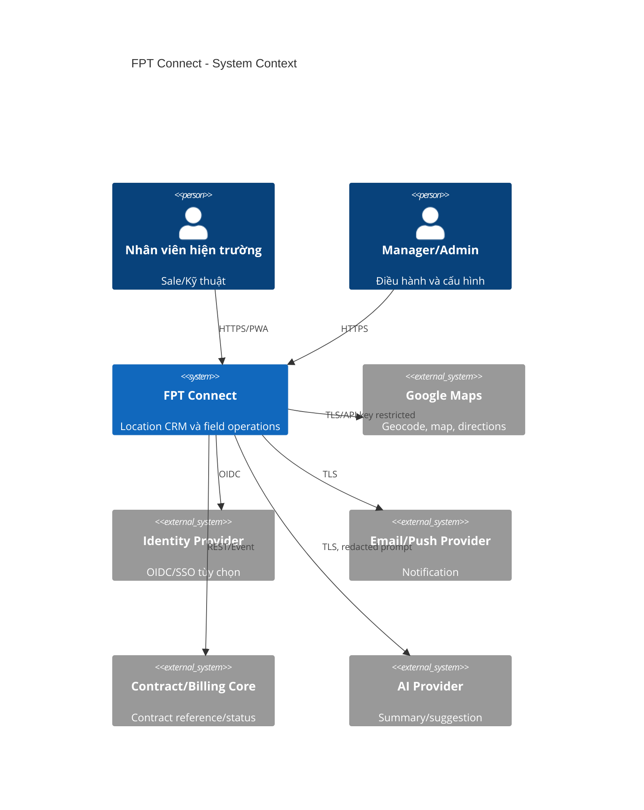
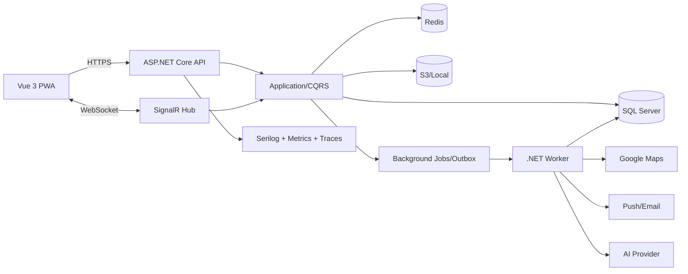
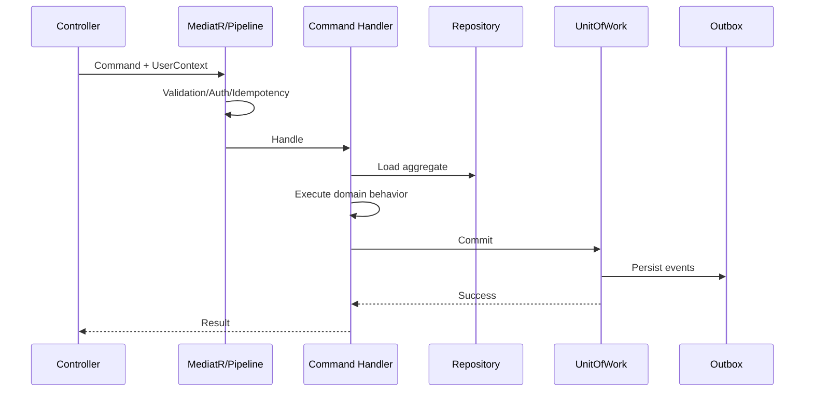

# 07. Solution Architecture

## 7.1 Context



## 7.2 Container



## 7.3 Clean Architecture

```text
src/
  FptConnect.Domain/          Entities, value objects, domain events, policies
  FptConnect.Application/     Use cases, CQRS handlers, DTOs, ports, validators
  FptConnect.Infrastructure/  EF Core, storage, maps, notifications, AI, cache
  FptConnect.Api/             HTTP, auth, middleware, SignalR, composition root
  FptConnect.Worker/          Outbox, reminders, route aggregation, retention
tests/
  Unit/
  Integration/
  Architecture/
  Api/
```

Dependency rule: `Domain <- Application <- Infrastructure/Api/Worker`. Domain không tham chiếu EF, HTTP, JWT, Serilog hoặc provider.

## 7.4 Bounded contexts

| Context | Aggregate chính | Sở hữu dữ liệu |
|---|---|---|
| Identity & Access | User, Role, Session | IAM |
| CRM | Customer, Interaction, Contract | Customer lifecycle |
| Field Operations | Visit, RouteSession, CheckIn | Hoạt động hiện trường |
| Technical Operations | Handoff, WorkOrder | Triển khai |
| Engagement | Reminder, Notification | Nhắc và giao tiếp |
| Analytics & AI | ReadModel, AiRun | Insight, không là system of record |
| Governance | Audit, Setting | Kiểm soát và cấu hình |

## 7.5 CQRS, Repository và Unit of Work

- Command thay đổi một aggregate root trong transaction; cross-aggregate dùng domain event + outbox.
- Query dùng projection trực tiếp (`AsNoTracking`) thay vì ép qua generic repository.
- Repository chỉ cho aggregate có hành vi: `ICustomerRepository`, `IRouteSessionRepository`; không tạo `IRepository<T>` lộ `IQueryable`.
- `IUnitOfWork.SaveChangesAsync` dispatch domain events vào transactional outbox trước commit.
- Validator kiểm tra syntax; domain entity kiểm tra invariant; authorization service kiểm tra scope.



## 7.6 Middleware order

1. Forwarded headers/trusted proxies.
2. Correlation/trace ID.
3. Exception -> Problem Details.
4. Security headers, HTTPS/HSTS.
5. Request size and rate limit.
6. Authentication.
7. Tenant/user context.
8. Authorization.
9. Idempotency for command endpoints.
10. Request logging/metrics.
11. Endpoint.

## 7.7 Authentication/authorization

- Access JWT: `sub`, `tenant`, `session`, minimal role hints; permission không nhồi toàn bộ vào token.
- Policy provider tải effective permission từ cache; version claim giúp invalidation.
- Resource authorization dùng `IAuthorizationScopeService` thêm predicate vào query.
- Refresh token lưu hash và rotation transaction.
- SignalR authenticate khi connect; mỗi group join phải kiểm tra scope, không tin group name client.

## 7.8 Event và background jobs

| Event | Consumer | Tác dụng | Dedup key |
|---|---|---|---|
| CustomerAssigned | Notification, SLA | Báo owner, tạo first-contact reminder | customer+assignment version |
| CustomerStatusChanged | Analytics, automation | Funnel, next task | history ID |
| CheckInNeedsReview | Notification | Báo manager | checkin ID |
| HandoffApproved | WorkOrder | Tạo work order | handoff ID |
| ReminderDue | Delivery | Tạo notification | reminder occurrence |
| RouteSessionStopped | Aggregator | Tính distance/polyline | session ID+algorithm |

Job dùng retry exponential + jitter, max attempts, dead-letter, correlation ID. Consumer idempotent bằng inbox/deduplication key.

## 7.9 Caching

| Data | Cache | TTL | Invalidation |
|---|---|---:|---|
| Permission policy | Redis + memory | 5 phút | Role/user version event |
| Settings | Redis | 5 phút | SettingPublished |
| Dashboard aggregate | Redis | 1-5 phút | TTL + event |
| Geocode result | Redis/DB | 30 ngày | Address hash |
| Customer detail | Không mặc định | - | Tránh stale PII |

Không cache token, secret, raw GPS hoặc signed URL lâu hơn lifetime.

## 7.10 Resilience và consistency

- Timeout ngắn theo dependency; retry chỉ idempotent operation.
- Circuit breaker Maps/AI/notification; bulkhead cho AI.
- SQL transient retry không bao quanh transaction không idempotent.
- Optimistic concurrency bằng rowversion; trả `409` với current representation metadata.
- Core CRM strong consistency trong aggregate; notification/dashboard eventual consistency có freshness indicator.

## 7.11 Security architecture notes

- Key management ngoài app; rotation và separation theo environment.
- CSP không cho inline script; map domains allowlist.
- SSRF defense cho mọi URL import/webhook; egress allowlist.
- SQL parameterized qua EF; raw SQL bắt buộc review và parameters.
- Dependency/SBOM/container scan trong CI.
- Threat model riêng cho GPS spoofing, IDOR, refresh reuse, file upload và prompt injection.

## 7.12 Performance budget

| Operation | Budget server | Query budget |
|---|---:|---:|
| Customer list | 350 ms P95 | <= 3 query |
| Customer detail shell | 300 ms | <= 5 query |
| Nearby 5 km | 500 ms | 1 spatial query |
| Check-in | 500 ms | <= 2 write + outbox |
| GPS batch 100 | 250 ms acknowledge | enqueue, async persist |
| Dashboard | 800 ms | aggregate/read model |

## 7.13 Architecture Decision Records

ADR bắt buộc cho thay đổi database engine, auth model, map provider, queue, storage, multi-tenancy, AI provider, retention hoặc breaking API. Template: Context, Decision, Options, Consequences, Security, Migration, Rollback, Owner, Date.

