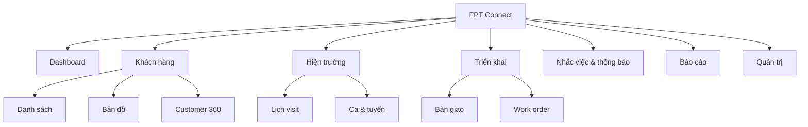

# 09. UI/UX Specification

## 9.1 Information architecture



## 9.2 Catalog 32 màn hình

| ID | Màn hình | Người dùng | Nội dung/Action chính | Empty/Error/Responsive |
|---|---|---|---|---|
| UI-01 | Login | All | Identifier, password, SSO, forgot | Lỗi chung; form 1 cột |
| UI-02 | MFA | Protected roles | OTP, recovery code | Countdown, paste 6 số |
| UI-03 | Dashboard cá nhân | Field staff | Task, visit, overdue, KPI | Widget skeleton/partial error |
| UI-04 | Dashboard quản lý | Manager | Funnel, SLA, workload, map | Filter sticky; mobile cards |
| UI-05 | Customer list | Sale/Manager | Search/filter/sort/bulk | Table desktop, cards mobile |
| UI-06 | Create customer | Sale | Fast form, duplicate hints, pin | Offline draft, step validation |
| UI-07 | Import customers | Manager | Upload/map/dry-run/report | Error file downloadable |
| UI-08 | Duplicate review | Manager | Side-by-side diff/merge | Conflict warning |
| UI-09 | Customer 360 | Scoped users | Header, status, owner, tabs | Sensitive fields masked |
| UI-10 | Customer timeline | Scoped users | Event filter, notes, attachments | Virtual list |
| UI-11 | Customer edit | Owner | Sectioned form, ETag warning | Merge conflict dialog |
| UI-12 | Customer map | Sale/Manager | Cluster, nearby, filters | List fallback if map fails |
| UI-13 | Visit calendar | Field/Manager | Day/week/list, create | Mobile agenda default |
| UI-14 | Visit detail | Assignee | Customer, route, checklist | Offline cached badge |
| UI-15 | Check-in | Assignee | Accuracy, distance, photo | Review reason path |
| UI-16 | Check-out | Assignee | Outcome, note, next action | Required checklist |
| UI-17 | Start shift | Field staff | Consent, GPS/device status | Tracking-disabled reason |
| UI-18 | Active tracking | Field staff | Timer, status, pending points, stop | Persistent privacy indicator |
| UI-19 | Route history | Staff/Manager | Date/user, polyline, gaps | Quality legend |
| UI-20 | Check-in review | Manager | Evidence/map/approve/reject | No self-approval |
| UI-21 | Reminder list | All | Today/upcoming/overdue | Swipe actions mobile |
| UI-22 | Reminder editor | All | Due/recurrence/assignee | Timezone preview |
| UI-23 | Notification inbox | All | Unread/type/deep link | Infinite cursor |
| UI-24 | Contract detail | Sale/Manager | Metadata/document/status | Restricted download |
| UI-25 | Handoff wizard | Sale | Checklist, window, review | Save draft |
| UI-26 | Handoff approval | Manager | Diff/risk/decision | Four-eyes indicator |
| UI-27 | Work order list | Tech/Manager | Status/assignee/SLA | Offline last-sync |
| UI-28 | Work order execution | Tech | Accept/checklist/evidence/complete | Large touch targets |
| UI-29 | Reports/export | Manager/Auditor | Templates/filter/job history | Watermark warning |
| UI-30 | AI assistant panel | Authorized | Summary/actions/citations/feedback | Provider fallback |
| UI-31 | Profile/sessions | All | Preferences, MFA, devices | Reauth for revoke-all |
| UI-32 | Admin console | Admin | User/role/org/settings/audit | Desktop-first, scoped nav |

## 9.3 Wireframes

### Customer list - desktop

```text
+---------------------------------------------------------------+
| FPT Connect | Search...              Alerts | User            |
+----------+----------------------------------------------------+
| Dashboard| Khach hang [New]                                  |
| Customer | [Status v] [Owner v] [Area v] [Date] [Saved views] |
| Field    |----------------------------------------------------|
| Work     | [ ] Name        Phone       Status    Owner  Next   |
| Reports  | [ ] Nguyen An   ***4567     Qualified Lan   14:30  |
| Admin    | [ ] Tran Binh   ***8899     New       Minh  Today  |
|          |----------------------------------------------------|
|          | 100 results                    < Previous  Next >   |
+----------+----------------------------------------------------+
```

### Active tracking - mobile

```text
+--------------------------+
| < Ca dang hoat dong  LIVE |
| 02:14:32                 |
| GPS Tot | 18m accuracy   |
| 12.4 km | 438 diem       |
|  3 diem dang cho dong bo |
|--------------------------|
| Lich tiep theo 14:30     |
| Nguyen Van An - 1.2 km   |
| [Chi duong] [Chi tiet]   |
|--------------------------|
|       [DUNG CA]          |
+--------------------------+
```

### Customer 360

```text
+--------------------------------------------------------------+
| Nguyen Van An | Qualified | Owner: Lan | [Edit] [More]       |
| ***4567 | Quan 1 | Last contact 2d | AI score 78 (Medium)    |
| [Overview] [Timeline] [Visits] [Contract] [Files]            |
|--------------------------------------------------------------|
| Next action: Call at 14:30       | Summary with citations    |
| Needs: Home Internet 1Gbps       | [1] Visit 10/06           |
| Map pin + address                | [Generate summary]        |
+--------------------------------------------------------------+
```

## 9.4 Luồng UX cốt lõi

### Tạo lead nhanh

1. FAB `Khách hàng mới`.
2. Nhập phone; duplicate lookup chạy sau debounce 400 ms.
3. Nếu match exact, mở hồ sơ có quyền hoặc gửi request access; không cho tạo trùng.
4. Nhập tên, nguồn; lấy GPS hiện tại sau khi user bấm.
5. Save local ngay, sync server; confirmation hiển thị owner và next action.

### Check-in

1. Màn hình visit hiển thị khoảng cách ước tính.
2. User bấm Check-in; app lấy 3 mẫu tối đa 10 giây và chọn accuracy tốt nhất.
3. UI hiển thị distance/accuracy, không dùng màu đơn lẻ.
4. Nếu review, yêu cầu reason/ảnh và giải thích manager sẽ duyệt.
5. Thành công chuyển ngay sang checklist visit.

## 9.5 UX rules

- Nút chính nằm vùng ngón cái trên mobile; target >= 44x44 px.
- Không dùng modal cho flow dài; dùng page/sheet/wizard.
- Destructive action có tên đối tượng, hậu quả và undo nếu khả thi.
- Form validate khi blur/submit; không xóa input khi API lỗi.
- Offline state luôn visible: `Đã lưu trên thiết bị`, `Đang đồng bộ`, `Cần xử lý`.
- Map có list alternative; marker cluster; không render hàng nghìn DOM marker.
- AI phân biệt rõ “Đề xuất” với dữ liệu đã xác nhận.

## 9.6 Accessibility

- Keyboard navigation và focus visible; focus trap đúng trong dialog.
- Label thật cho input; error gắn `aria-describedby`; live region cho sync/toast.
- Contrast AA; chart có bảng dữ liệu và pattern/label.
- Motion theo `prefers-reduced-motion`.
- Bản đồ không phải cách duy nhất để chọn customer/location.

## 9.7 Analytics events

| Event | Properties không PII | Mục đích |
|---|---|---|
| `customer_create_started/completed` | source, offline, duration | Funnel tạo lead |
| `duplicate_warning_resolved` | matchType, decision | Chất lượng dedupe |
| `checkin_submitted` | distanceBand, accuracyBand, result | GPS UX |
| `offline_sync_result` | itemType, count, errorCode | Reliability |
| `ai_suggestion_feedback` | useCase, accepted, reason | AI evaluation |

