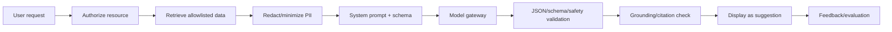

# 11. AI Capabilities and Governance

## 11.1 Phạm vi

AI là lớp hỗ trợ quyết định, không phải nguồn dữ liệu gốc. V1 gồm: customer summary, note draft, next best action, customer score và route suggestion. Tất cả chức năng có feature flag và fallback không AI.

## 11.2 Use case design

| Capability | Input được phép | Output | Human control | Fallback |
|---|---|---|---|---|
| AI Summary | Timeline scoped, status, visits | 5-10 bullet + citation | User đọc/feedback | Rule summary |
| AI Note | User dictation/text draft | Note đã cấu trúc | Bắt buộc edit/confirm | Plain editor |
| AI Suggest | Status, SLA, outcomes | 1-3 next actions | Accept tạo draft/task | Rule engine |
| Customer Score | Approved features | 0-100 + band/factors | Không auto-reject | No score |
| AI Reminder | Accepted action, calendar | Draft reminder | User xác nhận | Manual |
| AI Route | Visits, time windows, travel matrix | Ordered plan + ETA | User edit/accept | Nearest-neighbor |

## 11.3 AI Summary contract

```json
{
  "summary": [
    {
      "text": "Khách quan tâm gói Internet 1Gbps và muốn lắp buổi sáng.",
      "citations": ["interaction:1842", "visit:920"],
      "confidence": 0.91
    }
  ],
  "missingInformation": ["Loại hạ tầng tại địa chỉ"],
  "generatedAtUtc": "2026-06-11T08:00:00Z",
  "promptVersion": "customer-summary-v3"
}
```

Schema validation fail thì không hiển thị output. Citation phải trỏ tới resource user có quyền xem.

## 11.4 Prompt pipeline



## 11.5 Prompt injection defense

- Customer notes/attachments là untrusted data, đặt trong delimiters và không được xem là instruction.
- Không cấp tool gọi API ghi cho model; application thực thi action sau khi user xác nhận.
- Retrieval allowlist theo field và resource scope.
- Output encode trước khi render; không render raw HTML/Markdown nguy hiểm.
- Detect yêu cầu tiết lộ system prompt, secret, dữ liệu customer khác; trả safe failure.
- Provider request không chứa token, password, full audit payload hoặc raw GPS route.

## 11.6 Customer scoring

Feature cho phép: recency/frequency interaction, status duration, response outcome, service availability, appointment completion. Không dùng giới tính, dân tộc, tôn giáo, sức khỏe, nội dung riêng tư hoặc proxy không được duyệt.

| Metric | Ngưỡng launch | Alert |
|---|---:|---:|
| AUC/PR-AUC | Theo imbalance, >= baseline + 10% | Giảm > 5% |
| Calibration error | < 0.08 | > 0.12 |
| Coverage | >= 70% eligible leads | < 60% |
| Drift PSI | < 0.20 | >= 0.25 |
| Acceptance rate | Chỉ quan sát, không ép target | Thay đổi bất thường |

Model card ghi data window, feature, exclusions, owner, approval, limitations và rollback. Score cũ hiển thị `calculatedAt`; không gọi đó là xác suất nếu chưa calibration.

## 11.7 Route optimization

Objective có trọng số: travel time, visit priority, SLA, time window, work hours và max distance. Hard constraints không được model ngôn ngữ tự ý bỏ. Google route matrix/optimizer hoặc thuật toán deterministic thực hiện tính toán; LLM chỉ giải thích plan.

## 11.8 Privacy, retention, cost

- Data minimization và provider no-training/retention policy theo hợp đồng.
- AI request/output chi tiết mặc định 180 ngày; prompt debug ở production tắt hoặc redacted.
- Token/cost budget theo tenant/use case/user; cache summary theo input hash.
- Timeout 15 giây interactive; quá thời gian chuyển async hoặc fallback.
- User có nút report output; flagged output quarantine cho review.

## 11.9 Evaluation set

Tối thiểu 200 customer timeline đã anonymize, phủ ngắn/dài, tiếng Việt không dấu, contradictory notes, missing data, prompt injection và restricted PII. Mỗi release chạy:

- Factuality/citation precision.
- Completeness nhưng không suy diễn.
- Toxicity/privacy leakage.
- JSON schema adherence.
- Latency/cost.
- Human rating theo rubric 1-5.

## 11.10 AI acceptance checklist

- [ ] Model/prompt version và input hash được lưu.
- [ ] Output có source, confidence phù hợp và disclaimer.
- [ ] Không có autonomous write/send.
- [ ] Có fallback, timeout, circuit breaker và budget.
- [ ] Red-team prompt injection/data exfiltration đạt.
- [ ] Drift/bias/cost dashboard và kill switch hoạt động.

