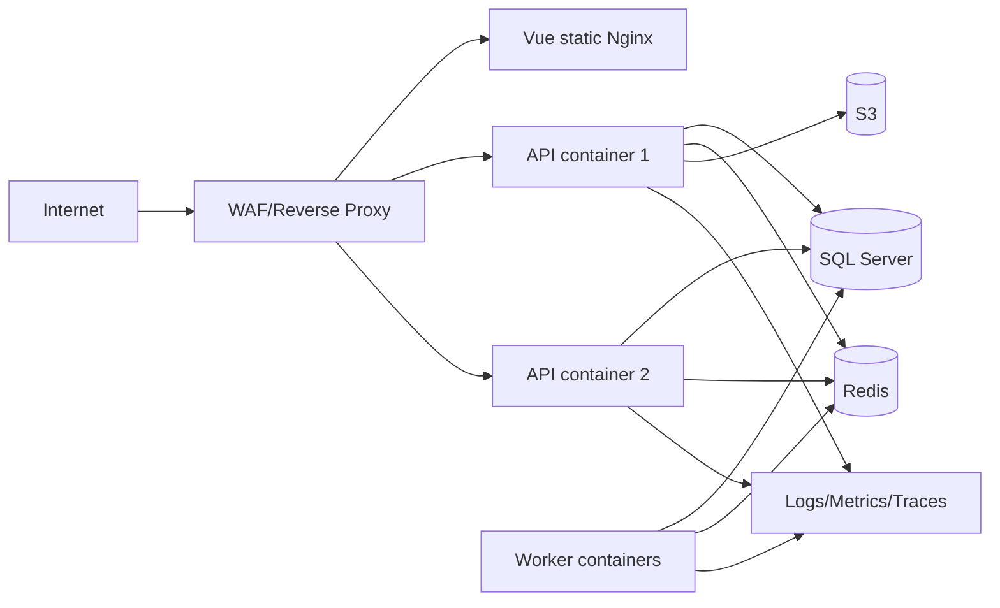
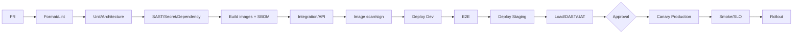

# 13. Deployment and Operations

## 13.1 Môi trường

| Environment | Mục đích | Data | Availability |
|---|---|---|---|
| Local | Dev | Synthetic | Best effort |
| Dev | Integration liên tục | Synthetic | Business hours |
| Staging | Production-like/UAT/load | Masked/synthetic | 99% |
| Production | Live | Real | 99.9% |
| DR | Recovery | Replicated/encrypted | Theo RTO |

Không dùng production data thô ở non-production.

## 13.2 Docker topology

Images multi-stage, pinned digest, non-root, read-only filesystem nếu có thể, healthcheck và resource limit. Không đóng gói secret vào image.

## 13.3 IIS và Nginx

**IIS:** ASP.NET Core Hosting Bundle đúng version; app pool `No Managed Code`; WebSocket bật; `web.config` không chứa secret; stdout log chỉ dùng chẩn đoán ngắn hạn.

**Nginx:** TLS termination, HTTP/2+, upload size theo API, proxy buffering phù hợp, WebSocket upgrade cho `/hubs`, timeout AI/export riêng nhưng bounded, security headers tại một nguồn cấu hình nhất quán.

## 13.4 HTTPS/DNS

- TLS 1.2/1.3, strong cipher, HSTS sau khi xác nhận toàn domain HTTPS.
- Certificate auto-renew và alert trước 30/14/7 ngày.
- Cookie nếu dùng: `Secure`, `HttpOnly`, `SameSite`; domain/path tối thiểu.
- Maps/API keys restricted theo domain/IP/API và quota.

## 13.5 SQL Server

- DB login riêng theo service, least privilege; migration identity tách runtime.
- TDE/volume encryption, encrypted connection, certificate validation.
- Index/statistics maintenance theo đo lường, không chạy mù theo lịch.
- Full daily, differential 6h, log 15m; checksum và restore test.
- Migration dùng expand-migrate-contract; backup trước thay đổi rủi ro.

## 13.6 CI/CD

Artifact immutable và promote cùng digest. Production approval tối thiểu Product Owner cho scope và Tech Lead/SRE cho change; emergency path có retrospective.

## 13.7 Deployment strategy

- Rolling/canary 5% -> 25% -> 100%; quan sát error/latency 10-30 phút mỗi bước.
- Feature flag tách deploy khỏi release.
- Rollback app bằng image digest trước; database rollback bằng forward-fix ưu tiên.
- Pre-deploy: compatibility, migration estimate, backup, capacity.
- Post-deploy: TC-300 smoke, queue lag, DB waits, 5xx, business event.

## 13.8 Observability

Dashboard: RED cho API, USE cho resource, DB waits/pool, Redis hit ratio, job queue/dead-letter, GPS lag, notification success, AI latency/cost/safety. Log tập trung JSON; OpenTelemetry trace qua API-worker-provider.

Alert phải actionable, có severity, owner, runbook và dedup. Không alert chỉ vì metric tồn tại.

## 13.9 Backup/restore runbook

1. Xác định incident time và required RPO.
2. Cô lập write nếu corruption đang tiếp diễn.
3. Chọn full + differential + log chain đã verify.
4. Restore vào isolated environment và chạy integrity/security checks.
5. Product/SRE phê duyệt cutover.
6. Rotate credential nếu incident liên quan compromise.
7. Reconcile outbox/provider events và thông báo stakeholder.
8. Ghi incident timeline, actual RPO/RTO và action.

## 13.10 Incident severity

| Severity | Ví dụ | Acknowledge | Update |
|---|---|---:|---:|
| SEV-1 | Toàn hệ thống down/rò rỉ dữ liệu | 10 phút | 30 phút |
| SEV-2 | Core flow lỗi diện rộng | 20 phút | 60 phút |
| SEV-3 | Feature phụ lỗi/degraded | 4 giờ | Hàng ngày |
| SEV-4 | Minor/cosmetic | 1 ngày làm việc | Theo ticket |

Security incident ưu tiên containment/evidence; không tự ý xóa log.

## 13.11 Production checklist

- [ ] DNS/TLS/WAF/rate limit/headers pass.
- [ ] Secret từ vault, rotation tested.
- [ ] Backup restore drill đạt RPO/RTO.
- [ ] Image signed, SBOM và scan pass.
- [ ] Migration rehearsal trên data-size tương đương.
- [ ] Dashboard/alert/runbook/on-call active.
- [ ] Feature flags và kill switch AI/Maps sẵn sàng.
- [ ] Privacy notice, retention jobs và audit verification active.

